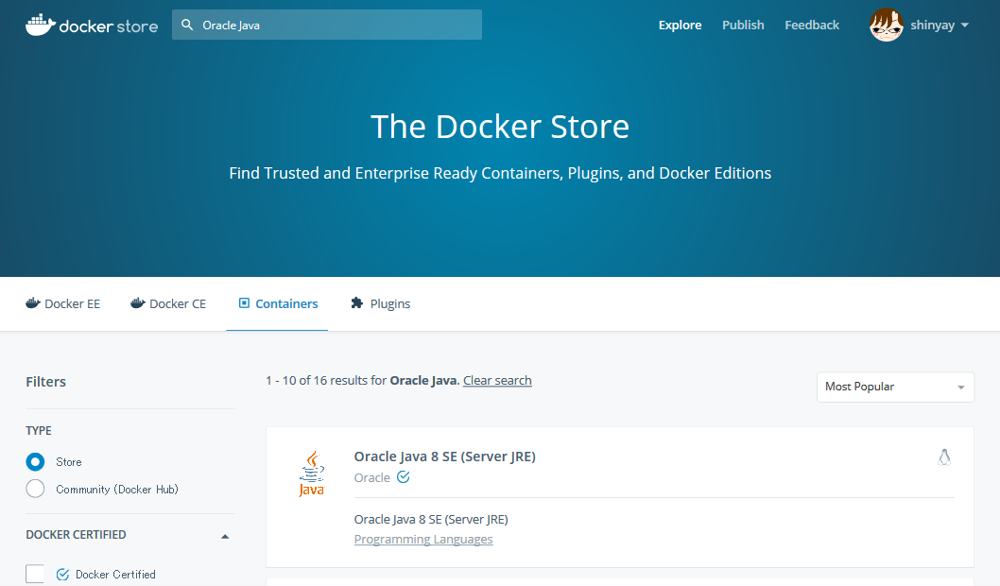
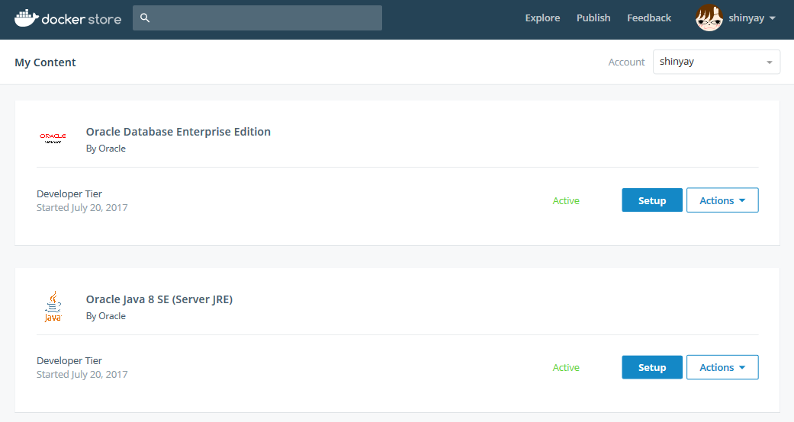

# Dockerfile for Maven

Docker Store で公開している Oracle Java を使用して、Apache Maven を実行することが可能な Docker Image を作成

## 説明

Java プロジェクトのプロジェクト管理ツール（ビルドや構成管理）として有名なツールに [Apache Maven](https://maven.apache.org/) が有名です。この Maven を利用するためには通常は Java をインストールして、Maven をインストールして、パスを通し、JAVA_HOME や MAVEN_HOME の設定などを行う必要があります。
そのような一連の環境を予め Docker イメージとして用意しました。これを利用する事で Maven が導入されていなくとても Maven プロジェクトのビルドをする事ができるようになります。

ここで用意した Maven 環境は、Java のランタイムとしては、Docker Store で公開している [Oracle 提供の Java 8](https://store.docker.com/images/oracle-serverjre-8) を利用します。

以下が、Java と Maven のバージョン情報です。

- Java: Oracle JDK 8 (1.8.0_131 : 2017年7月時点での latest イメージのバージョンです)
- Mavan: Maven 3.5.0

## 動作イメージ

Maven が導入されていない環境で Docker コンテナ内の Maven によるプロジェクトビルドを行う動作イメージです:

## 前提
- Docker Store のアカウントを持っていること
- Oracle Java 8 の Docker イメージを Docker Store でチェックアウトしていること
  - [Oracle Java 8 SE (Server JRE)](https://store.docker.com/images/oracle-serverjre-8)

## 導入

Docker Hub に公開しているイメージを取得します

`docker pull shinyay/docker-mvn-jdk8:3.5.0`

## 使用方法

ホスト環境にある Maven プロジェクトを Docker コンテナにマウントし、ワークディレクトリを マウントポイントに移動して Maven コマンドを実行します。

`docker run -it --rm -v [ホスト環境の Mavenプロジェクトパス]:[コンテナ環境内のマウントポイント] -w [コンテナ環境内のマウントポイント] shinyay/docker-mvn-jdk8:3.5.0 mvn [MAVEN GOAL]`

## Docker オプション
- **-it** : 標準入力/tty端末デバイスの確保
- **--rm** : コンテナ終了時にコンテナを破棄
- **-v** : ボリュームマウント
- **-w** : 作業用ディレクトリの指定(デフォルトはルートディレクトリ )

### 例1: mvn clean
`docker run -it --rm -v /home/shinyay/works/mvn-projects/mvn-webapp/mytest-app:/usr/src/mvnproject -w /usr/src/mvnproject shinya/mvn:3.5.0 mvn clean`

### 例2: mvn package
`docker run -it --rm -v /home/shinyay/works/mvn-projects/mvn-webapp/mytest-app:/usr/src/mvnproject -w /usr/src/mvnproject shinya/mvn:3.5.0 mvn package`

## Licence

Released under the [MIT license](https://gist.githubusercontent.com/shinyay/56e54ee4c0e22db8211e05e70a63247e/raw/44f0f4de510b4f2b918fad3c91e0845104092bff/LICENSE)

## Author

[shinyay](https://github.com/shinyay)
